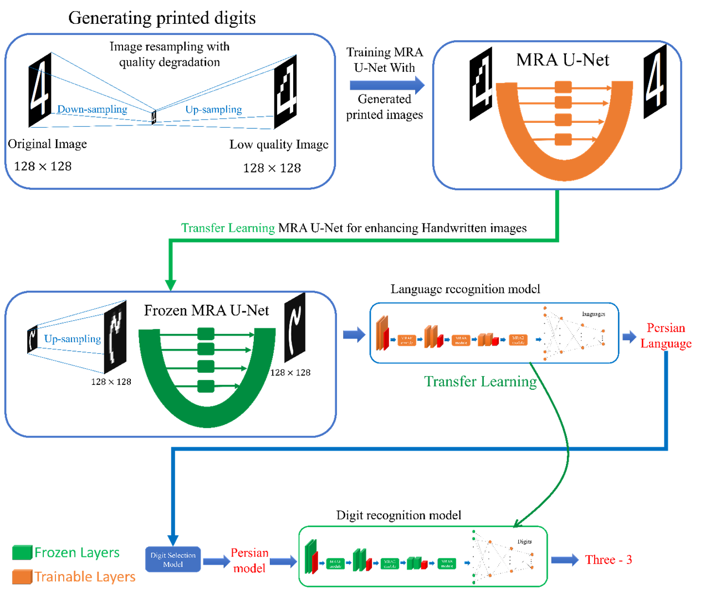

## Advancing Multilingual Handwritten Numeral Recognition with Attention-driven Transfer Learning
This is the implementation of the paper "Advancing Multilingual Handwritten Numeral Recognition with Attention-driven Transfer Learning" by Amirreza Fateh, Reza Tahmasbi Birgani, Mansoor Fateh, and Vahid Abolghasemi.


<br>
<p align="middle">
    
</p>
For more information, check out our paper on [[ieeexplore](https://ieeexplore.ieee.org/document/10474004/authors)].

## Requirements

- Python 3.12.2
- Keras 3.1.1
- Tensorflow 2.16.1
- scipy 1.12.0
- scikit-learn 1.4.1
- numpy 1.26.4
- pandas 2.2.1
- opencv-python 4.9.0.80
- seaborn 0.13.2
- matplotlib 3.8.3

## .bib citation
To cite the paper (early access version), use the following format:

    @article{fateh2024advancing,
    title={Advancing Multilingual Handwritten Numeral Recognition with Attention-driven Transfer Learning},
    author={Fateh, Amirreza and Tahmasbi Birgani, Reza and Fateh, Mansoor and Abolghasemi, Vahid},
    journal={IEEE Access},
    year={2024},
    publisher={Institute of Electrical and Electronics Engineers}
    }
    
<!--
Conda environment settings:
```bash
conda create -n protoformer python=3.8
conda activate protoformer

conda install pytorch=1.8.1 torchvision cudatoolkit=11.1 -c pytorch
conda install -c conda-forge tensorflow
pip install tensorboardX
```

## Preparing Few-Shot Segmentation Datasets
Download following datasets:

> #### 1. Handwritten digit dataset
> Download Handwritten digit dataset (train/val data):
> ```bash
> wget http://host.robots.ox.ac.uk/pascal/VOC/voc2012/VOCtrainval_11-May-2012.tar
> ```
> Download handwritten digit dataset from [[Google Drive](https://)].
>
Create a directory '../Datasets' for the above two few-shot segmentation datasets and appropriately place each dataset to have following directory structure:

    ../                         # parent directory
    ├── ./                      # current (project) directory
    │   ├── common/             # (dir.) helper functions
    │   ├── data/               # (dir.) dataloaders and splits for each FSSS dataset
    │   ├── model/              # (dir.) implementation of ProtoFormer model 
    │   ├── README.md           # intstruction for reproduction
    │   ├── train.py            # code for training HSNet
    │   └── test.py             # code for testing HSNet
    └── Datasets/
        ├── VOC2012/            # PASCAL VOC2012 devkit
        │   ├── Annotations/
        │   ├── ImageSets/
        │   ├── ...
        │   └── SegmentationClassAug/
        ├── COCO2014/           
            ├── annotations/
            │   ├── train2014/  # (dir.) training masks (from Google Drive) 
            │   ├── val2014/    # (dir.) validation masks (from Google Drive)
            │   └── ..some json files..
            ├── train2014/
            └── val2014/

> ### Babysitting training:
> Use tensorboard to babysit training progress:
> - For each experiment, a directory that logs training progress will be automatically generated under logs/ directory. 
> - From terminal, run 'tensorboard --logdir logs/' to monitor the training progress.
> - Choose the best model when the validation (mIoU) curve starts to saturate. 


## Testing

> ### 1. PASCAL-5<sup>i</sup>
> Pretrained models are available on our [[Google Drive](https://drive.google.com/drive/folders/1xomPmr6dYpjDDraIQJS51gLCCj8T0jmf?usp=sharing)].
> ```bash
> python test.py --layers {50, 101} 
>                --fold {0, 1, 2, 3} 
>                --benchmark pascal
>                --nshot {1, 5} 
>                --load "path_to_trained_model"
> ```


> ### 2. COCO-20<sup>i</sup>
> Pretrained models are available on our [[Google Drive](https://drive.google.com/drive/folders/1vy7QHpEx4p10xwrhpeshD3uuKJdhXiim?usp=sharing)].
> ```bash
> python test.py --layers {50, 101}
>                --fold {0, 1, 2, 3} 
>                --benchmark coco 
>                --nshot {1, 5} 
>                --load "path_to_trained_model"
> ```

This project is built upon HSNet:https://github.com/juhongm999/hsnet
-->
